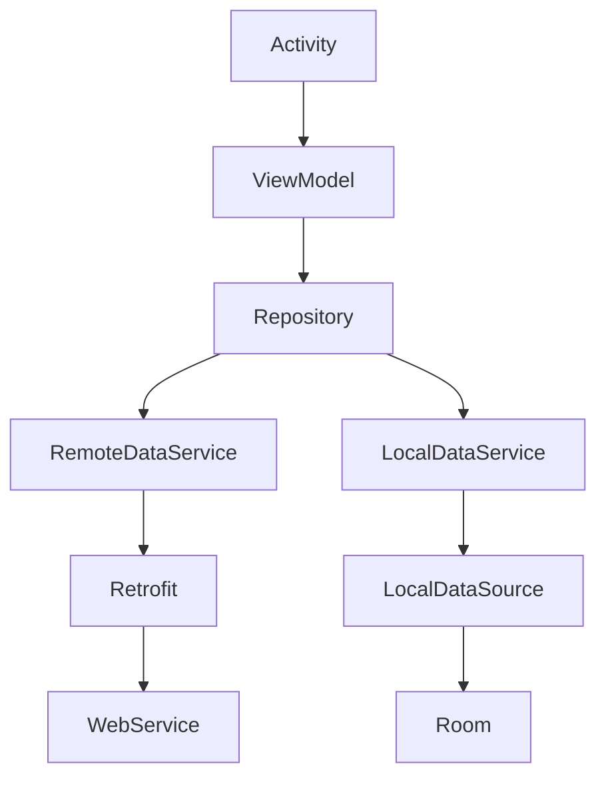

The application connect to Apple's RSS to fetch the top 100 music albums across all genres

Album items are showing in grid view with 2 item in each row containing the thumbnail, name and the artist name When click
on each item user will navigate to detail page that can see the big picture of the album with more data such as genres,
release date and copyright info. Also there is a button in detail page to navigate user to the album page in iTunes
website (Note: there is no iTunes app in android so it just navigate to the website)

+ you can click on the genre items to navigate to the genre detail page in iTunes website

More notes:
The Rss feed doesn't return the image in big size, so I just did a small hack and changed the url from 100x100.jpg to
800x800.jpg to be able to get bigger image for detail screen. On the expected behavior asked to have detail page as
Fragment, But I preferred to use Activity that is more make sense for Android best practise
(We use Fragment mostly for viewpager or when you want to see list and detail in same time in tablet so you can use both
view together, So when you have a list with detail page for UX perspective it's better to separate it by Activity)

The app cache data offline by **Realm** database and can work when it is offline, I used Realm because of two reason:

- First because it has been encouraged to use it
- Second because it's more easier to keep genre list data inside each album data and we don't need to have tables and
  relations between them. Also it has good compatibility with Kotlin coroutines that I used to handle multi threading and
  communicating with IO threat

**MVVM** architecture has been used for the architecture of the application, which the graph of dependency is like this:

The unit test has written for the **ViewModel**, **Repository**, **Service**, and **Mappers** to test the application
business logic

- For dependency injection, the app using **Koin** library
- To show and cache album image, the app using **Picasso** library
- The app uses **Kotlin Coroutines** to handle IO thread processing like getting data from server or database
- For communicating with server app using **Retrofit** with **Gson** converter and **OkHttp** client

There are some notes regarding the Design:

- We don't have blur action bar in android so I just used the simple toolbar
- For Grid view there is no description that if the image should have fixed size or based on the phone width they should
  scale so I scaled the items based on device width otherwise it would broke on different devices
- Also almost same problem in detail page, there is not description if image should be 1x1 and the rest for detail or should
  have fixed height and scale the image so I just used 1x1 scale for image
- Another thing regarding design is the alignment of the copy right and button, it's not very clear if there should have
  some space from the genre items or they should be aligned from the bottom, So I just align them from the bottom but it may
  broke in devices with small height and we have some data overlapped
- Also the font's and some drawable was not on zeplin so I just download similar name font and made my own drawables
- Also for app icon I used Android Studio Icon builder tools
